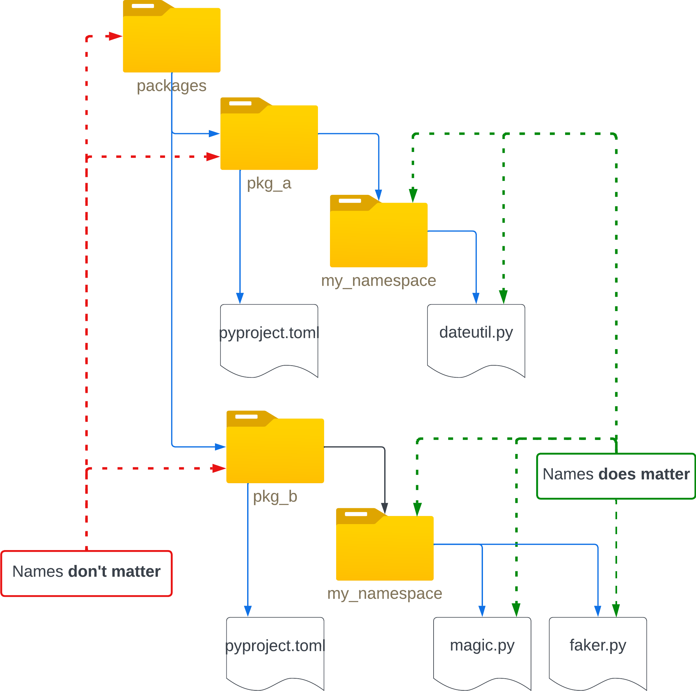

# Packaging "Native Namespace Packages"  

1. `python >= 3.3`
2. `pip >= 21.3`
3. `setuptools >= 64`

## [Implicit Namespace Packages](https://peps.python.org/pep-0420/)  

Example of a __Namespace Package__ folder structure:  
(Or see picture at the bottom)

- [snake-corp](.) (root folder)
  - [snake-corp-datutil](snake-corp-dateutil)
    - [snake_corp](snake-corp-dateutil/snake_corp)
      - [dateutil.py](snake-corp-dateutil/snake_corp/dateutil.py)
    - [pyproject.toml](snake-corp-dateutil/pyproject.toml)

  - [snake-corp-magic-numbers](snake-corp-magic-numbers)
    - [snake_corp](snake-corp-magic-numbers/snake_corp)
      - [magic.py](snake-corp-magic-numbers/snake_corp/magic.py)  
    - [pyproject.toml](snake-corp-magic-numbers/pyproject.toml)

---



---

Install with: `python -m pip install -e snake-corp-dateutil/`  
From GitHub:  
`python -m pip install "pkg @ vcs+protocol://repo_url/#subdirectory=pkg_dir"`  
`python -m pip install "snake-corp-timestamp-generator @ git+https://github.com/ahnm1/snake-corp/#subdirectory=snake-corp-timestamp-generator"`  

---

These type of packages are a bit __slower__ to import.  
Read more here:  

- <https://realpython.com/python-namespace-package/>
- <https://pip.pypa.io/en/stable/reference/build-system/pyproject-toml/>
- <https://setuptools.pypa.io/en/latest/userguide/pyproject_config.html>
- <https://setuptools.pypa.io/en/latest/userguide/package_discovery.html>
- <https://packaging.python.org/en/latest/guides/packaging-namespace-packages/>  

> __Note 1:__ Because native and pkgutil-style namespace packages are largely compatible, you can use native namespace packages in the distributions that only support Python 3 and pkgutil-style namespace packages in the distributions that need to support Python 2 and 3.  

> __Note 2:__ It is __extremely important__ that every distribution that uses the __namespace package__ omits the `__init__.py` or uses a __pkgutil-style__ `__init__.py`. If any distribution does not, it will cause the namespace logic to __fail__ and the other sub-packages __will not be importable.__

---

<!-- 2143 × 2128 = 714 x 709 = 535 x 532 -->

Testing:

```bash
pip install --upgrade setuptools virtualenv nox
nox --report report.json
```

`nox` will execute all of the scenarios and report whether the namespace packages are able to be imported successfully after installation. You can use `python report_to_table.py` to transform the report into a markdown-friendly table.

__Examples on GitHub:__ <https://github.com/pypa/sample-namespace-packages/blob/master/README.md>
